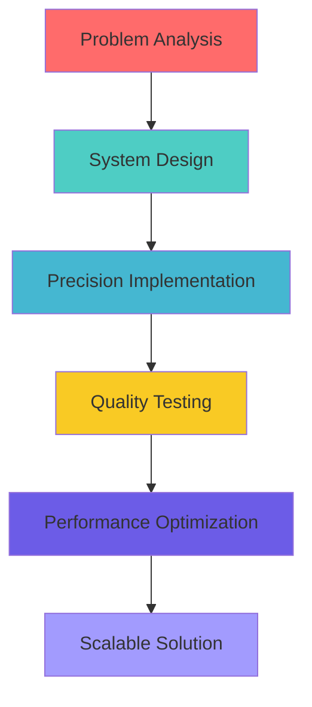

# ⚙️ Varun S - Full Stack Developer & Mechanical Engineer

<div align="center">
  
  
  
  [](https://git.io/typing-svg)

</div>

---

## 🔧 About Me

```java
public class Developer {
    private String name = "Varun S";
    private String location = "Bengaluru, India";
    private String role = "Results-driven Full Stack Developer";
    private String background = "Mechanical Engineering";
    
    public String getMission() {
        return "Applying engineering precision to build innovative, " +
               "scalable web solutions that solve real-world problems";
    }
}
```

I'm a **results-driven developer** with a unique blend of mechanical engineering principles and modern software development expertise. I approach coding with the same precision and problem-solving mindset that drives mechanical innovation—building robust, efficient, and scalable solutions.

---

## 🛠️ Technical Arsenal

<div align="center">

### **Core Programming**


### **Frontend Engineering**


### **Backend Architecture**


### **Database Systems**


### **Development Tools**


### **Version Control**


</div>

---

## ⚡ Engineering Approach



### 🔩 **Mechanical Precision in Code**
- **Systematic Problem-Solving**: Breaking down complex challenges into manageable components
- **Engineering Efficiency**: Writing clean, maintainable, and optimized code
- **Quality Assurance**: Rigorous testing and validation processes
- **Scalable Architecture**: Building systems that grow with demand

---

## 🚀 Technical Expertise

<table>
<tr>
<td width="50%">

### **🎯 Frontend Mastery**
- **Modern React Development**
  - Component-based architecture
  - State management & hooks
  - Performance optimization
- **Next.js Applications**
  - Server-side rendering
  - API routes & middleware
  - SEO optimization
- **Responsive Design**
  - Mobile-first approach
  - Cross-browser compatibility
  - Tailwind CSS & Shadcn UI

</td>
<td width="50%">

### **⚙️ Backend Engineering**
- **Java Spring Ecosystem**
  - Spring Boot applications
  - Spring MVC architecture
  - Hibernate ORM
- **API Development**
  - RESTful web services
  - Swagger documentation
  - Microservices architecture
- **Database Management**
  - MySQL & Oracle systems
  - Query optimization
  - Data modeling

</td>
</tr>
</table>

---

## 🔗 Connect & Collaborate

<div align="center">

[](mailto:varunvijay0402@gmail.com)
[](https://linkedin.com/in/varun-s0402/)
[](#)

</div>

---

## 💡 Engineering Philosophy

> *"Just as mechanical systems require precision, balance, and efficiency, great software demands the same engineering principles. I bring mechanical engineering discipline to every line of code I write."*

<div align="center">

**🔧 Precision • 🚀 Innovation • ⚡ Performance • 🎯 Results**

---

*Building the future, one commit at a time.*


</div>
